# Deployment Documentation

## 1. Fork Repository

> Use fork to create a new repository

## 2. Purchase Domain

> Buy from NIAGAHOSTER

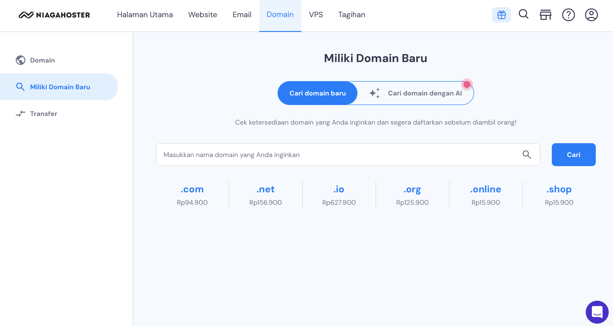

> Domain successfully purchased

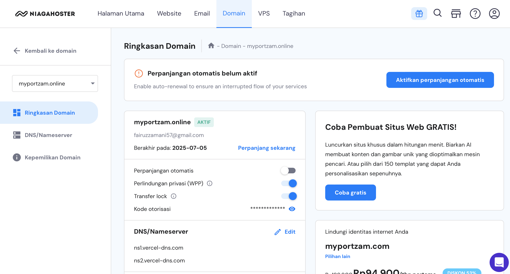

## 3. Move to Vercel

1. **Add New Project**

   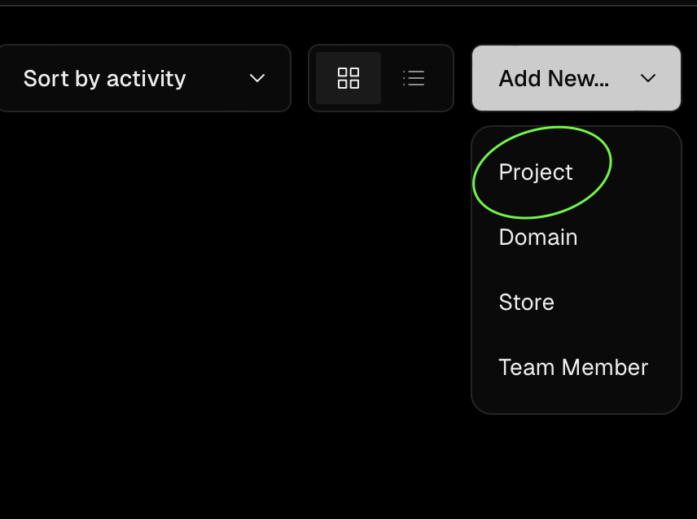

2. **Import Repository**

   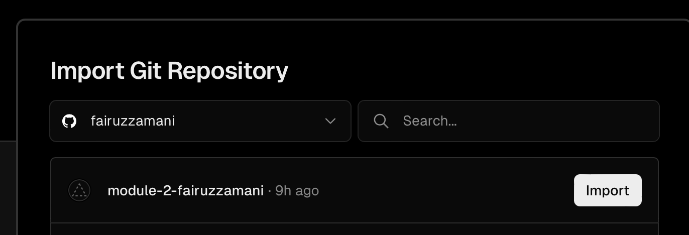

3. **Create Project Name and Deploy**

   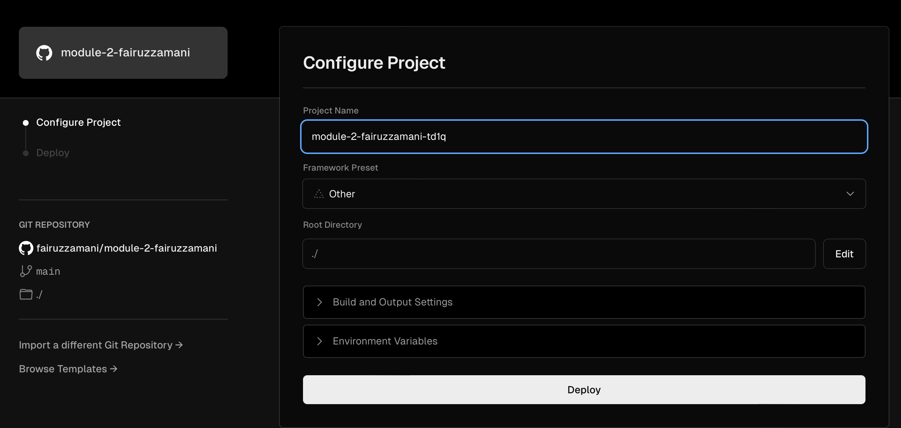

## Deployment Process

1. **Add Domain and Select Data**

   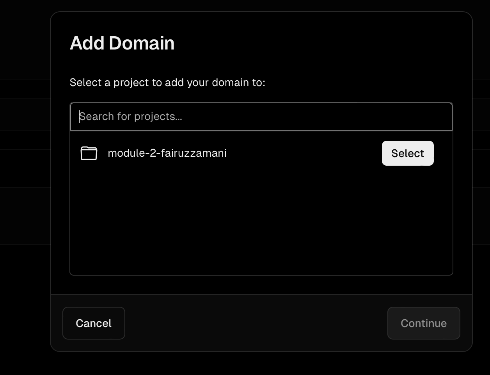

2. **Enter Purchased Niagahoster Domain Link**

   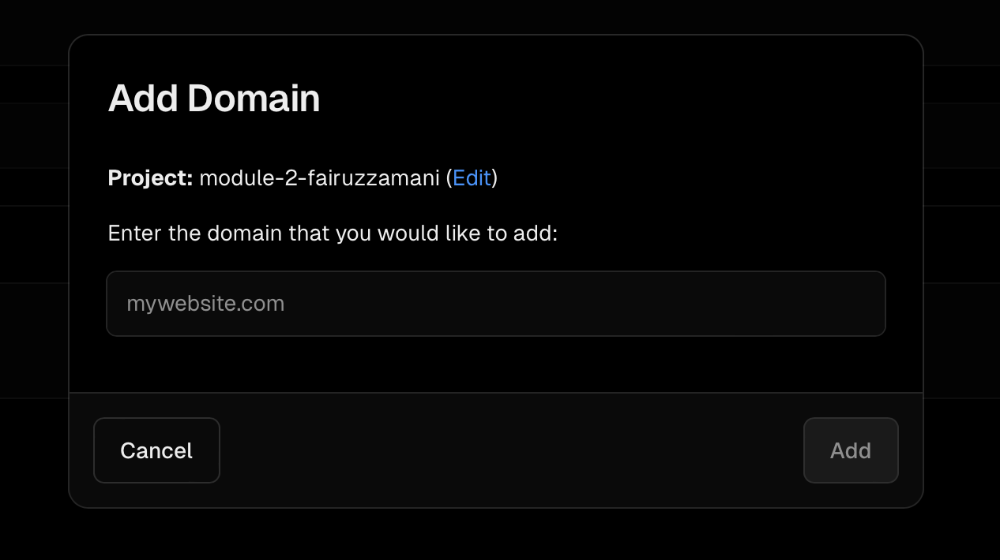
   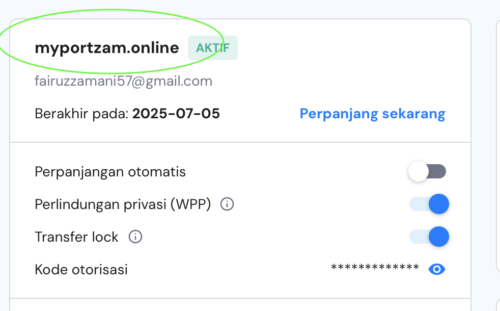

3. **Add Domain**

   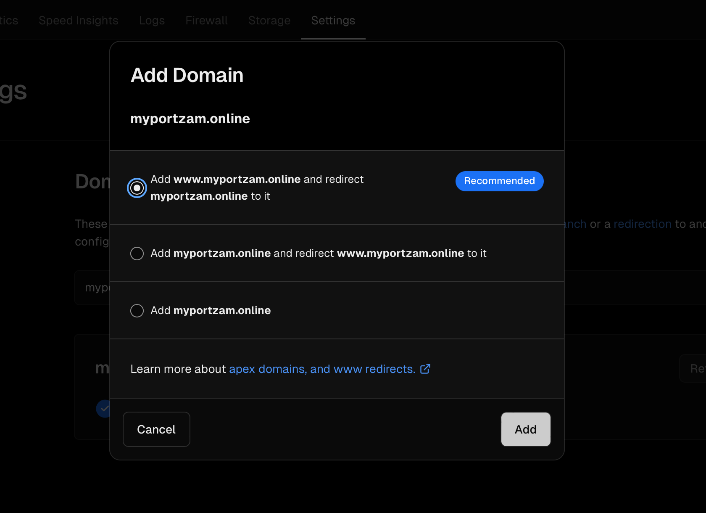

4. **If Domain is Invalid**

   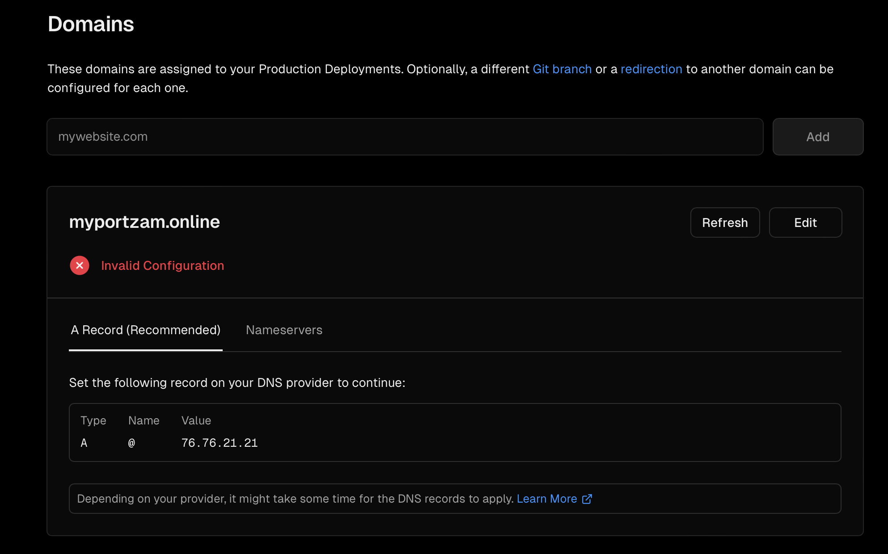

5. **Change DNS Name Server in Niaga Hoster to Vercel's Name Server**

   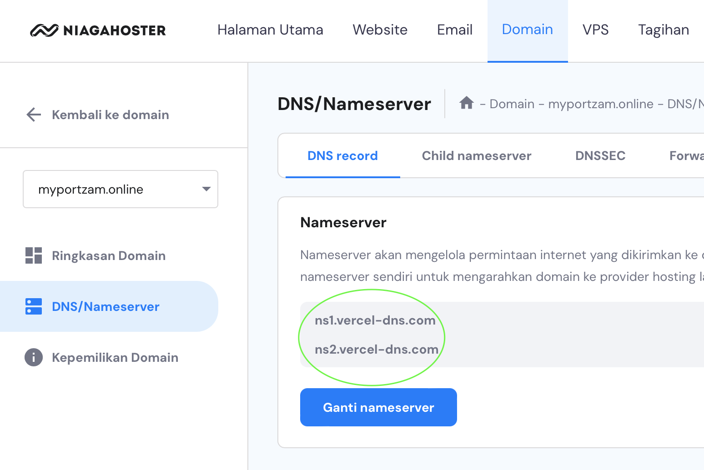
   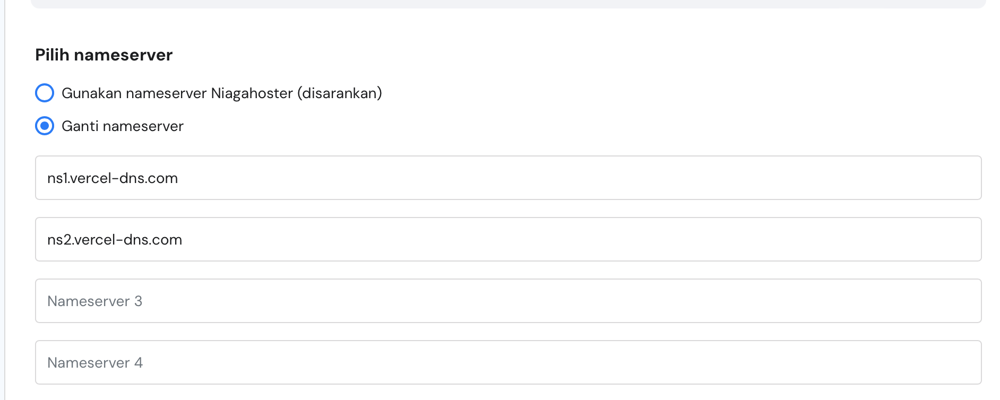

> **WAIT UP TO 24 HOURS**

## Successful Deployment

> Domain Successfully Deployed (DONE)

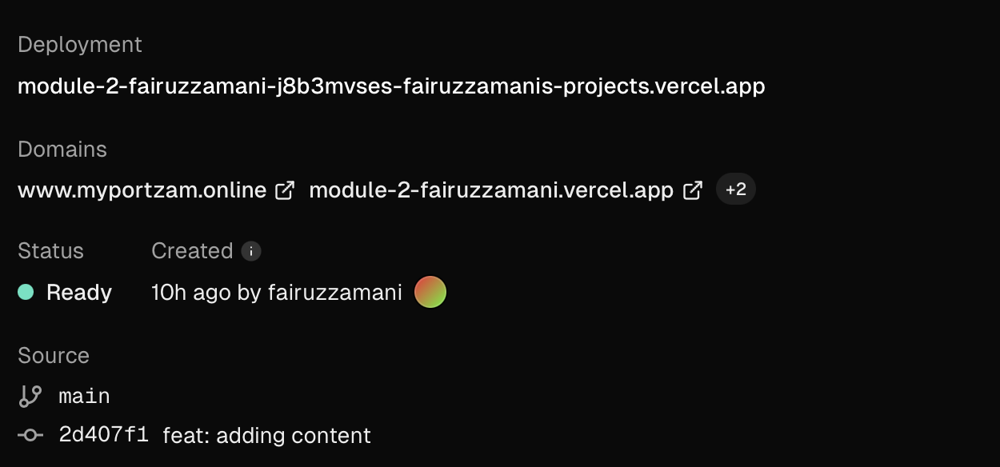

## Deployment Link

> My Deployment: [https://www.myportzam.online/](https://www.myportzam.online/)
